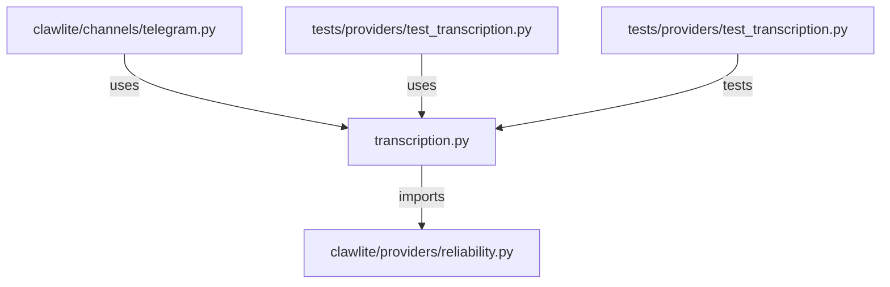

# CONNECTIONS clawlite/providers/transcription.py

## Relationship Summary

- Imports 1 internal file(s).
- Imported by 2 internal file(s).
- Matched test files: 1.

## Internal Imports

- `clawlite/providers/reliability.py`

## Reverse Dependencies

- `clawlite/channels/telegram.py`
- `tests/providers/test_transcription.py`

## Matching Tests

- `tests/providers/test_transcription.py`

## Mermaid

