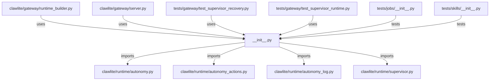

# CONNECTIONS clawlite/runtime/__init__.py

## Relationship Summary

- Imports 4 internal file(s).
- Imported by 4 internal file(s).
- Matched test files: 2.

## Internal Imports

- `clawlite/runtime/autonomy.py`
- `clawlite/runtime/autonomy_actions.py`
- `clawlite/runtime/autonomy_log.py`
- `clawlite/runtime/supervisor.py`

## Reverse Dependencies

- `clawlite/gateway/runtime_builder.py`
- `clawlite/gateway/server.py`
- `tests/gateway/test_supervisor_recovery.py`
- `tests/gateway/test_supervisor_runtime.py`

## Matching Tests

- `tests/jobs/__init__.py`
- `tests/skills/__init__.py`

## Mermaid

