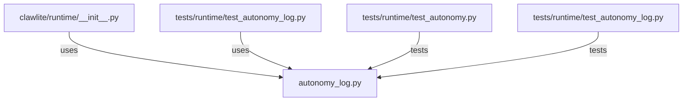

# CONNECTIONS clawlite/runtime/autonomy_log.py

## Relationship Summary

- Imports 0 internal file(s).
- Imported by 2 internal file(s).
- Matched test files: 2.

## Reverse Dependencies

- `clawlite/runtime/__init__.py`
- `tests/runtime/test_autonomy_log.py`

## Matching Tests

- `tests/runtime/test_autonomy.py`
- `tests/runtime/test_autonomy_log.py`

## Mermaid

