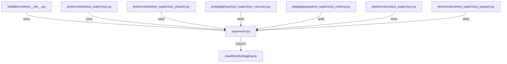

# CONNECTIONS clawlite/runtime/supervisor.py

## Relationship Summary

- Imports 1 internal file(s).
- Imported by 3 internal file(s).
- Matched test files: 4.

## Internal Imports

- `clawlite/utils/logging.py`

## Reverse Dependencies

- `clawlite/runtime/__init__.py`
- `tests/runtime/test_supervisor.py`
- `tests/runtime/test_supervisor_phase5.py`

## Matching Tests

- `tests/gateway/test_supervisor_recovery.py`
- `tests/gateway/test_supervisor_runtime.py`
- `tests/runtime/test_supervisor.py`
- `tests/runtime/test_supervisor_phase5.py`

## Mermaid

