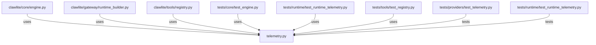

# CONNECTIONS clawlite/runtime/telemetry.py

## Relationship Summary

- Imports 0 internal file(s).
- Imported by 6 internal file(s).
- Matched test files: 2.

## Reverse Dependencies

- `clawlite/core/engine.py`
- `clawlite/gateway/runtime_builder.py`
- `clawlite/tools/registry.py`
- `tests/core/test_engine.py`
- `tests/runtime/test_runtime_telemetry.py`
- `tests/tools/test_registry.py`

## Matching Tests

- `tests/providers/test_telemetry.py`
- `tests/runtime/test_runtime_telemetry.py`

## Mermaid

