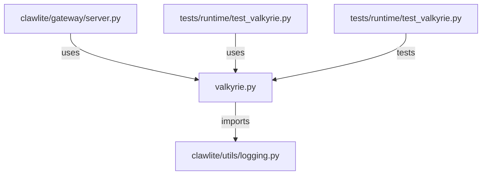

# CONNECTIONS clawlite/runtime/valkyrie.py

## Relationship Summary

- Imports 1 internal file(s).
- Imported by 2 internal file(s).
- Matched test files: 1.

## Internal Imports

- `clawlite/utils/logging.py`

## Reverse Dependencies

- `clawlite/gateway/server.py`
- `tests/runtime/test_valkyrie.py`

## Matching Tests

- `tests/runtime/test_valkyrie.py`

## Mermaid

