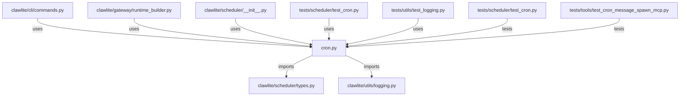

# CONNECTIONS clawlite/scheduler/cron.py

## Relationship Summary

- Imports 2 internal file(s).
- Imported by 5 internal file(s).
- Matched test files: 2.

## Internal Imports

- `clawlite/scheduler/types.py`
- `clawlite/utils/logging.py`

## Reverse Dependencies

- `clawlite/cli/commands.py`
- `clawlite/gateway/runtime_builder.py`
- `clawlite/scheduler/__init__.py`
- `tests/scheduler/test_cron.py`
- `tests/utils/test_logging.py`

## Matching Tests

- `tests/scheduler/test_cron.py`
- `tests/tools/test_cron_message_spawn_mcp.py`

## Mermaid

