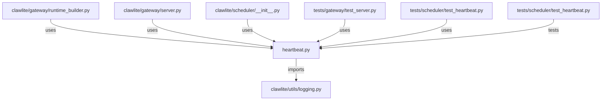

# CONNECTIONS clawlite/scheduler/heartbeat.py

## Relationship Summary

- Imports 1 internal file(s).
- Imported by 5 internal file(s).
- Matched test files: 1.

## Internal Imports

- `clawlite/utils/logging.py`

## Reverse Dependencies

- `clawlite/gateway/runtime_builder.py`
- `clawlite/gateway/server.py`
- `clawlite/scheduler/__init__.py`
- `tests/gateway/test_server.py`
- `tests/scheduler/test_heartbeat.py`

## Matching Tests

- `tests/scheduler/test_heartbeat.py`

## Mermaid

