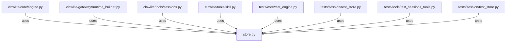

# CONNECTIONS clawlite/session/store.py

## Relationship Summary

- Imports 0 internal file(s).
- Imported by 7 internal file(s).
- Matched test files: 1.

## Reverse Dependencies

- `clawlite/core/engine.py`
- `clawlite/gateway/runtime_builder.py`
- `clawlite/tools/sessions.py`
- `clawlite/tools/skill.py`
- `tests/core/test_engine.py`
- `tests/session/test_store.py`
- `tests/tools/test_sessions_tools.py`

## Matching Tests

- `tests/session/test_store.py`

## Mermaid

