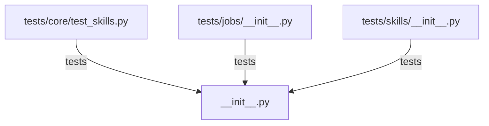

# CONNECTIONS clawlite/skills/__init__.py

## Relationship Summary

- Imports 0 internal file(s).
- Imported by 0 internal file(s).
- Matched test files: 3.

## Matching Tests

- `tests/core/test_skills.py`
- `tests/jobs/__init__.py`
- `tests/skills/__init__.py`

## Mermaid

