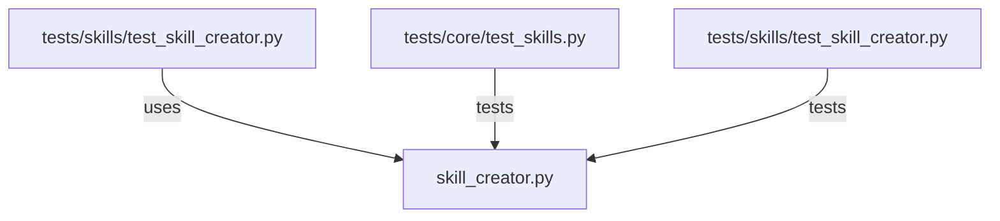

# CONNECTIONS clawlite/skills/skill_creator.py

## Relationship Summary

- Imports 0 internal file(s).
- Imported by 1 internal file(s).
- Matched test files: 2.

## Reverse Dependencies

- `tests/skills/test_skill_creator.py`

## Matching Tests

- `tests/core/test_skills.py`
- `tests/skills/test_skill_creator.py`

## Mermaid

