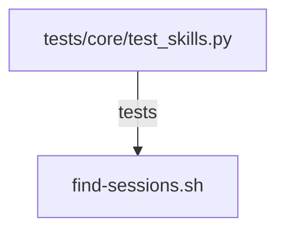

# CONNECTIONS clawlite/skills/tmux/scripts/find-sessions.sh

## Relationship Summary

- Imports 0 internal file(s).
- Imported by 0 internal file(s).
- Matched test files: 1.

## Matching Tests

- `tests/core/test_skills.py`

## Mermaid

