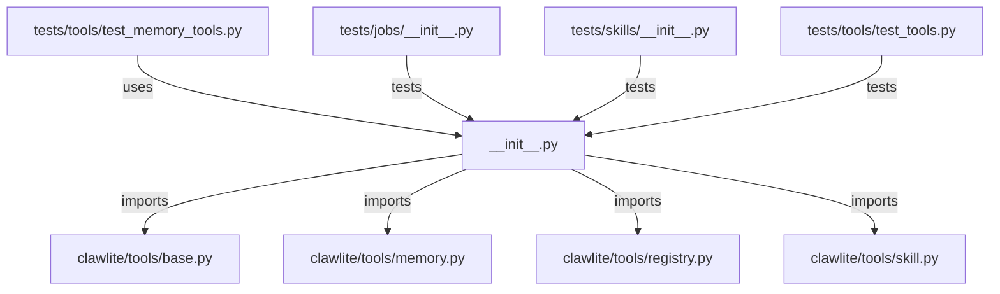

# CONNECTIONS clawlite/tools/__init__.py

## Relationship Summary

- Imports 4 internal file(s).
- Imported by 1 internal file(s).
- Matched test files: 3.

## Internal Imports

- `clawlite/tools/base.py`
- `clawlite/tools/memory.py`
- `clawlite/tools/registry.py`
- `clawlite/tools/skill.py`

## Reverse Dependencies

- `tests/tools/test_memory_tools.py`

## Matching Tests

- `tests/jobs/__init__.py`
- `tests/skills/__init__.py`
- `tests/tools/test_tools.py`

## Mermaid

