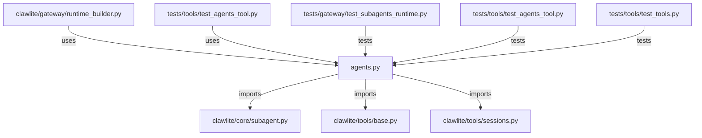

# CONNECTIONS clawlite/tools/agents.py

## Relationship Summary

- Imports 3 internal file(s).
- Imported by 2 internal file(s).
- Matched test files: 3.

## Internal Imports

- `clawlite/core/subagent.py`
- `clawlite/tools/base.py`
- `clawlite/tools/sessions.py`

## Reverse Dependencies

- `clawlite/gateway/runtime_builder.py`
- `tests/tools/test_agents_tool.py`

## Matching Tests

- `tests/gateway/test_subagents_runtime.py`
- `tests/tools/test_agents_tool.py`
- `tests/tools/test_tools.py`

## Mermaid

