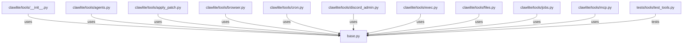

# CONNECTIONS clawlite/tools/base.py

## Relationship Summary

- Imports 0 internal file(s).
- Imported by 40 internal file(s).
- Matched test files: 1.

## Reverse Dependencies

- `clawlite/tools/__init__.py`
- `clawlite/tools/agents.py`
- `clawlite/tools/apply_patch.py`
- `clawlite/tools/browser.py`
- `clawlite/tools/cron.py`
- `clawlite/tools/discord_admin.py`
- `clawlite/tools/exec.py`
- `clawlite/tools/files.py`
- `clawlite/tools/jobs.py`
- `clawlite/tools/mcp.py`
- `clawlite/tools/memory.py`
- `clawlite/tools/message.py`
- `clawlite/tools/pdf.py`
- `clawlite/tools/process.py`
- `clawlite/tools/registry.py`
- `clawlite/tools/sessions.py`
- `clawlite/tools/skill.py`
- `clawlite/tools/spawn.py`
- `clawlite/tools/tts.py`
- `clawlite/tools/web.py`
- `tests/core/test_engine.py`
- `tests/tools/test_agents_tool.py`
- `tests/tools/test_apply_patch.py`
- `tests/tools/test_browser_tool.py`
- `tests/tools/test_cron_message_spawn_mcp.py`
- `tests/tools/test_discord_admin_tool.py`
- `tests/tools/test_exec_files.py`
- `tests/tools/test_files_edge_cases.py`
- `tests/tools/test_health_check.py`
- `tests/tools/test_jobs_tool.py`
- `tests/tools/test_mcp.py`
- `tests/tools/test_memory_tools.py`
- `tests/tools/test_process_tool.py`
- `tests/tools/test_registry.py`
- `tests/tools/test_result_cache.py`
- `tests/tools/test_sessions_tools.py`
- `tests/tools/test_skill_tool.py`
- `tests/tools/test_timeout_middleware.py`
- `tests/tools/test_tools.py`
- `tests/tools/test_web.py`

## Matching Tests

- `tests/tools/test_tools.py`

## Mermaid

