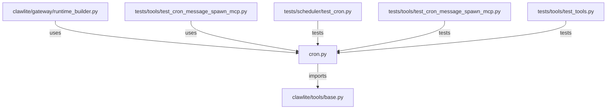

# CONNECTIONS clawlite/tools/cron.py

## Relationship Summary

- Imports 1 internal file(s).
- Imported by 2 internal file(s).
- Matched test files: 3.

## Internal Imports

- `clawlite/tools/base.py`

## Reverse Dependencies

- `clawlite/gateway/runtime_builder.py`
- `tests/tools/test_cron_message_spawn_mcp.py`

## Matching Tests

- `tests/scheduler/test_cron.py`
- `tests/tools/test_cron_message_spawn_mcp.py`
- `tests/tools/test_tools.py`

## Mermaid

