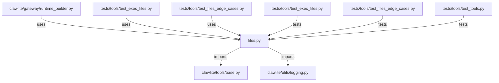

# CONNECTIONS clawlite/tools/files.py

## Relationship Summary

- Imports 2 internal file(s).
- Imported by 3 internal file(s).
- Matched test files: 3.

## Internal Imports

- `clawlite/tools/base.py`
- `clawlite/utils/logging.py`

## Reverse Dependencies

- `clawlite/gateway/runtime_builder.py`
- `tests/tools/test_exec_files.py`
- `tests/tools/test_files_edge_cases.py`

## Matching Tests

- `tests/tools/test_exec_files.py`
- `tests/tools/test_files_edge_cases.py`
- `tests/tools/test_tools.py`

## Mermaid

