# CONNECTIONS clawlite/tools/memory.py

## Relationship Summary

- Imports 2 internal file(s).
- Imported by 3 internal file(s).
- Matched test files: 30.

## Internal Imports

- `clawlite/core/memory.py`
- `clawlite/tools/base.py`

## Reverse Dependencies

- `clawlite/gateway/runtime_builder.py`
- `clawlite/tools/__init__.py`
- `tests/tools/test_memory_tools.py`

## Matching Tests

- `tests/core/test_memory_api.py`
- `tests/core/test_memory_artifacts.py`
- `tests/core/test_memory_backend.py`
- `tests/core/test_memory_classification.py`
- `tests/core/test_memory_consolidator.py`
- `tests/core/test_memory_curation.py`
- `tests/core/test_memory_history.py`
- `tests/core/test_memory_ingest.py`
- `tests/core/test_memory_ingest_helpers.py`
- `tests/core/test_memory_layers.py`
- `tests/core/test_memory_maintenance.py`
- `tests/core/test_memory_monitor.py`
- `tests/core/test_memory_policy.py`
- `tests/core/test_memory_privacy.py`
- `tests/core/test_memory_proactive.py`
- `tests/core/test_memory_profile.py`
- `tests/core/test_memory_prune.py`
- `tests/core/test_memory_quality.py`
- `tests/core/test_memory_reporting.py`
- `tests/core/test_memory_resources.py`
- `tests/core/test_memory_resources_helpers.py`
- `tests/core/test_memory_retrieval.py`
- `tests/core/test_memory_search.py`
- `tests/core/test_memory_ttl.py`
- `tests/core/test_memory_versions.py`
- `tests/core/test_memory_workflows.py`
- `tests/core/test_memory_working_set.py`
- `tests/gateway/test_memory_dashboard.py`
- `tests/tools/test_memory_tools.py`
- `tests/tools/test_tools.py`

## Mermaid

```mermaid
flowchart TD
    N0["memory.py"]
    D1["clawlite/core/memory.py"]
    D2["clawlite/tools/base.py"]
    R1["clawlite/gateway/runtime_builder.py"]
    R2["clawlite/tools/__init__.py"]
    R3["tests/tools/test_memory_tools.py"]
    T1["tests/core/test_memory_api.py"]
    T2["tests/core/test_memory_artifacts.py"]
    T3["tests/core/test_memory_backend.py"]
    T4["tests/core/test_memory_classification.py"]
    T5["tests/core/test_memory_consolidator.py"]
    T6["tests/core/test_memory_curation.py"]
    T7["tests/core/test_memory_history.py"]
    T8["tests/core/test_memory_ingest.py"]
    T9["tests/core/test_memory_ingest_helpers.py"]
    T10["tests/core/test_memory_layers.py"]
    N0 -->|imports| D1
    N0 -->|imports| D2
    R1 -->|uses| N0
    R2 -->|uses| N0
    R3 -->|uses| N0
    T1 -->|tests| N0
    T2 -->|tests| N0
    T3 -->|tests| N0
    T4 -->|tests| N0
    T5 -->|tests| N0
    T6 -->|tests| N0
    T7 -->|tests| N0
    T8 -->|tests| N0
    T9 -->|tests| N0
    T10 -->|tests| N0
```

