# CONNECTIONS clawlite/tools/registry.py

## Relationship Summary

- Imports 3 internal file(s).
- Imported by 9 internal file(s).
- Matched test files: 3.

## Internal Imports

- `clawlite/config/schema.py`
- `clawlite/runtime/telemetry.py`
- `clawlite/tools/base.py`

## Reverse Dependencies

- `clawlite/cli/commands.py`
- `clawlite/gateway/runtime_builder.py`
- `clawlite/tools/__init__.py`
- `clawlite/tools/skill.py`
- `tests/core/test_engine.py`
- `tests/tools/test_registry.py`
- `tests/tools/test_result_cache.py`
- `tests/tools/test_skill_tool.py`
- `tests/tools/test_timeout_middleware.py`

## Matching Tests

- `tests/providers/test_registry_auth_resolution.py`
- `tests/tools/test_registry.py`
- `tests/tools/test_tools.py`

## Mermaid

```mermaid
flowchart TD
    N0["registry.py"]
    D1["clawlite/config/schema.py"]
    D2["clawlite/runtime/telemetry.py"]
    D3["clawlite/tools/base.py"]
    R1["clawlite/cli/commands.py"]
    R2["clawlite/gateway/runtime_builder.py"]
    R3["clawlite/tools/__init__.py"]
    R4["clawlite/tools/skill.py"]
    R5["tests/core/test_engine.py"]
    R6["tests/tools/test_registry.py"]
    R7["tests/tools/test_result_cache.py"]
    R8["tests/tools/test_skill_tool.py"]
    R9["tests/tools/test_timeout_middleware.py"]
    T1["tests/providers/test_registry_auth_resolution.py"]
    T2["tests/tools/test_registry.py"]
    T3["tests/tools/test_tools.py"]
    N0 -->|imports| D1
    N0 -->|imports| D2
    N0 -->|imports| D3
    R1 -->|uses| N0
    R2 -->|uses| N0
    R3 -->|uses| N0
    R4 -->|uses| N0
    R5 -->|uses| N0
    R6 -->|uses| N0
    R7 -->|uses| N0
    R8 -->|uses| N0
    R9 -->|uses| N0
    T1 -->|tests| N0
    T2 -->|tests| N0
    T3 -->|tests| N0
```

