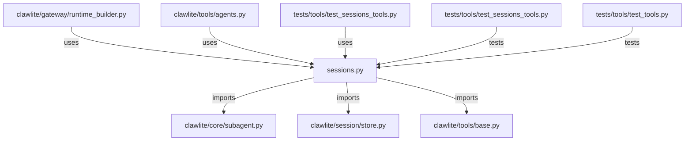

# CONNECTIONS clawlite/tools/sessions.py

## Relationship Summary

- Imports 3 internal file(s).
- Imported by 3 internal file(s).
- Matched test files: 2.

## Internal Imports

- `clawlite/core/subagent.py`
- `clawlite/session/store.py`
- `clawlite/tools/base.py`

## Reverse Dependencies

- `clawlite/gateway/runtime_builder.py`
- `clawlite/tools/agents.py`
- `tests/tools/test_sessions_tools.py`

## Matching Tests

- `tests/tools/test_sessions_tools.py`
- `tests/tools/test_tools.py`

## Mermaid

