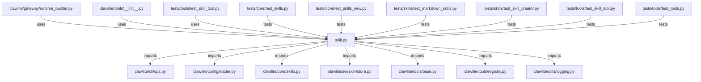

# CONNECTIONS clawlite/tools/skill.py

## Relationship Summary

- Imports 7 internal file(s).
- Imported by 3 internal file(s).
- Matched test files: 6.

## Internal Imports

- `clawlite/cli/ops.py`
- `clawlite/config/loader.py`
- `clawlite/core/skills.py`
- `clawlite/session/store.py`
- `clawlite/tools/base.py`
- `clawlite/tools/registry.py`
- `clawlite/utils/logging.py`

## Reverse Dependencies

- `clawlite/gateway/runtime_builder.py`
- `clawlite/tools/__init__.py`
- `tests/tools/test_skill_tool.py`

## Matching Tests

- `tests/core/test_skills.py`
- `tests/core/test_skills_new.py`
- `tests/skills/test_markdown_skills.py`
- `tests/skills/test_skill_creator.py`
- `tests/tools/test_skill_tool.py`
- `tests/tools/test_tools.py`

## Mermaid

