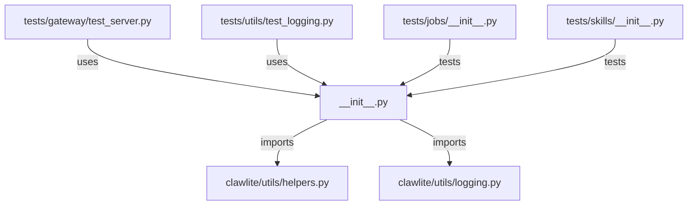

# CONNECTIONS clawlite/utils/__init__.py

## Relationship Summary

- Imports 2 internal file(s).
- Imported by 2 internal file(s).
- Matched test files: 2.

## Internal Imports

- `clawlite/utils/helpers.py`
- `clawlite/utils/logging.py`

## Reverse Dependencies

- `tests/gateway/test_server.py`
- `tests/utils/test_logging.py`

## Matching Tests

- `tests/jobs/__init__.py`
- `tests/skills/__init__.py`

## Mermaid

