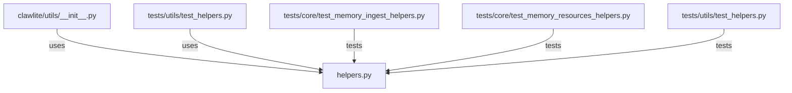

# CONNECTIONS clawlite/utils/helpers.py

## Relationship Summary

- Imports 0 internal file(s).
- Imported by 2 internal file(s).
- Matched test files: 3.

## Reverse Dependencies

- `clawlite/utils/__init__.py`
- `tests/utils/test_helpers.py`

## Matching Tests

- `tests/core/test_memory_ingest_helpers.py`
- `tests/core/test_memory_resources_helpers.py`
- `tests/utils/test_helpers.py`

## Mermaid

