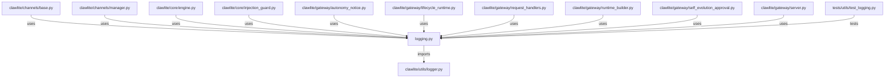

# CONNECTIONS clawlite/utils/logging.py

## Relationship Summary

- Imports 1 internal file(s).
- Imported by 27 internal file(s).
- Matched test files: 1.

## Internal Imports

- `clawlite/utils/logger.py`

## Reverse Dependencies

- `clawlite/channels/base.py`
- `clawlite/channels/manager.py`
- `clawlite/core/engine.py`
- `clawlite/core/injection_guard.py`
- `clawlite/gateway/autonomy_notice.py`
- `clawlite/gateway/lifecycle_runtime.py`
- `clawlite/gateway/request_handlers.py`
- `clawlite/gateway/runtime_builder.py`
- `clawlite/gateway/self_evolution_approval.py`
- `clawlite/gateway/server.py`
- `clawlite/gateway/tool_approval.py`
- `clawlite/gateway/websocket_handlers.py`
- `clawlite/runtime/autonomy.py`
- `clawlite/runtime/gjallarhorn.py`
- `clawlite/runtime/self_evolution.py`
- `clawlite/runtime/supervisor.py`
- `clawlite/runtime/valkyrie.py`
- `clawlite/runtime/volva.py`
- `clawlite/scheduler/cron.py`
- `clawlite/scheduler/heartbeat.py`
- `clawlite/tools/exec.py`
- `clawlite/tools/files.py`
- `clawlite/tools/mcp.py`
- `clawlite/tools/skill.py`
- `clawlite/tools/web.py`
- `clawlite/utils/__init__.py`
- `tests/core/test_engine.py`

## Matching Tests

- `tests/utils/test_logging.py`

## Mermaid

