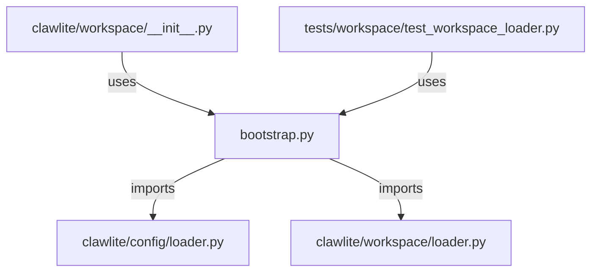

# CONNECTIONS clawlite/workspace/bootstrap.py

## Relationship Summary

- Imports 2 internal file(s).
- Imported by 2 internal file(s).
- Matched test files: 0.

## Internal Imports

- `clawlite/config/loader.py`
- `clawlite/workspace/loader.py`

## Reverse Dependencies

- `clawlite/workspace/__init__.py`
- `tests/workspace/test_workspace_loader.py`

## Mermaid

