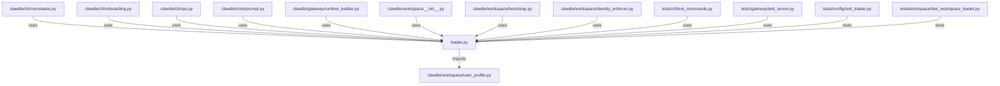

# CONNECTIONS clawlite/workspace/loader.py

## Relationship Summary

- Imports 1 internal file(s).
- Imported by 12 internal file(s).
- Matched test files: 2.

## Internal Imports

- `clawlite/workspace/user_profile.py`

## Reverse Dependencies

- `clawlite/cli/commands.py`
- `clawlite/cli/onboarding.py`
- `clawlite/cli/ops.py`
- `clawlite/core/prompt.py`
- `clawlite/gateway/runtime_builder.py`
- `clawlite/workspace/__init__.py`
- `clawlite/workspace/bootstrap.py`
- `clawlite/workspace/identity_enforcer.py`
- `tests/cli/test_commands.py`
- `tests/gateway/test_server.py`
- `tests/workspace/test_user_profile.py`
- `tests/workspace/test_workspace_loader.py`

## Matching Tests

- `tests/config/test_loader.py`
- `tests/workspace/test_workspace_loader.py`

## Mermaid

