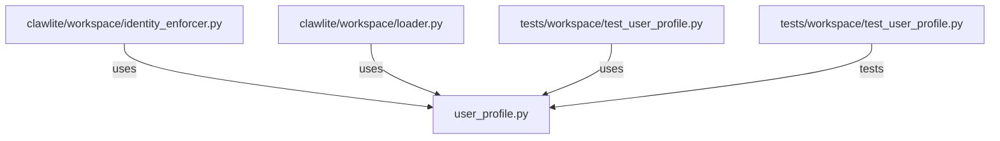

# CONNECTIONS clawlite/workspace/user_profile.py

## Relationship Summary

- Imports 0 internal file(s).
- Imported by 3 internal file(s).
- Matched test files: 1.

## Reverse Dependencies

- `clawlite/workspace/identity_enforcer.py`
- `clawlite/workspace/loader.py`
- `tests/workspace/test_user_profile.py`

## Matching Tests

- `tests/workspace/test_user_profile.py`

## Mermaid

