# CONNECTIONS scripts/capture_frames.py

## Relationship Summary

- Imports 1 internal file(s).
- Imported by 2 internal file(s).
- Matched test files: 1.

## Internal Imports

- `scripts/terminal_template.py`

## Reverse Dependencies

- `scripts/make_demo_gif.py`
- `tests/scripts/test_capture_frames.py`

## Matching Tests

- `tests/scripts/test_capture_frames.py`

## Mermaid

```mermaid
flowchart TD
    N0["capture_frames.py"]
    D1["scripts/terminal_template.py"]
    R1["scripts/make_demo_gif.py"]
    R2["tests/scripts/test_capture_frames.py"]
    T1["tests/scripts/test_capture_frames.py"]
    N0 -->|imports| D1
    R1 -->|uses| N0
    R2 -->|uses| N0
    T1 -->|tests| N0
```

