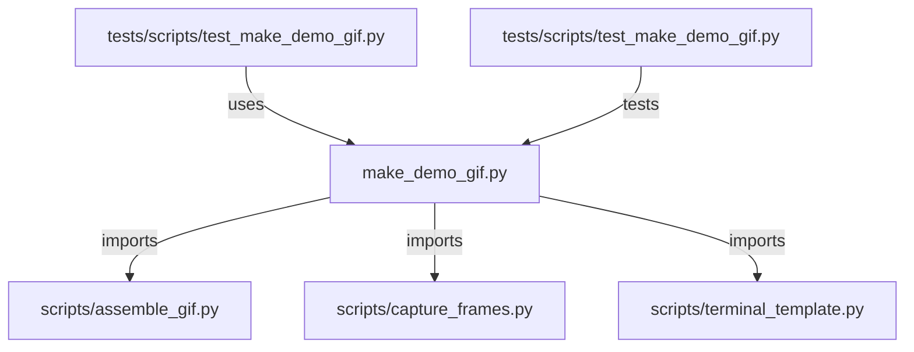

# CONNECTIONS scripts/make_demo_gif.py

## Relationship Summary

- Imports 3 internal file(s).
- Imported by 1 internal file(s).
- Matched test files: 1.

## Internal Imports

- `scripts/assemble_gif.py`
- `scripts/capture_frames.py`
- `scripts/terminal_template.py`

## Reverse Dependencies

- `tests/scripts/test_make_demo_gif.py`

## Matching Tests

- `tests/scripts/test_make_demo_gif.py`

## Mermaid

