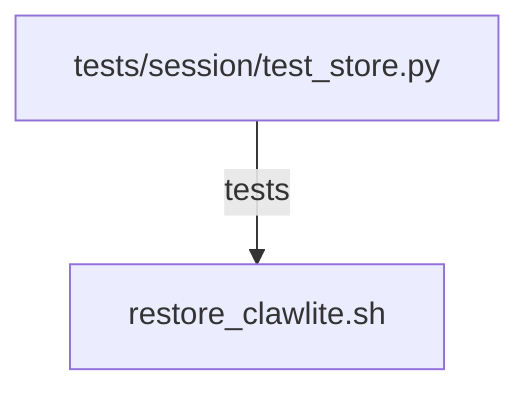

# CONNECTIONS scripts/restore_clawlite.sh

## Relationship Summary

- Imports 0 internal file(s).
- Imported by 0 internal file(s).
- Matched test files: 1.

## Matching Tests

- `tests/session/test_store.py`

## Mermaid

