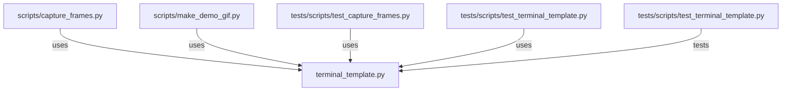

# CONNECTIONS scripts/terminal_template.py

## Relationship Summary

- Imports 0 internal file(s).
- Imported by 4 internal file(s).
- Matched test files: 1.

## Reverse Dependencies

- `scripts/capture_frames.py`
- `scripts/make_demo_gif.py`
- `tests/scripts/test_capture_frames.py`
- `tests/scripts/test_terminal_template.py`

## Matching Tests

- `tests/scripts/test_terminal_template.py`

## Mermaid

