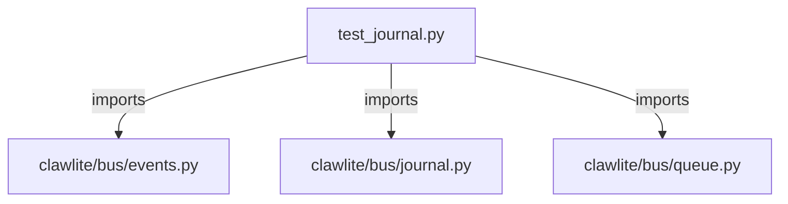

# CONNECTIONS tests/bus/test_journal.py

## Relationship Summary

- Imports 3 internal file(s).
- Imported by 0 internal file(s).
- Matched test files: 0.

## Internal Imports

- `clawlite/bus/events.py`
- `clawlite/bus/journal.py`
- `clawlite/bus/queue.py`

## Candidate Sources Exercised By This Test File

- `clawlite/bus/journal.py`
- `clawlite/jobs/journal.py`

## Mermaid

