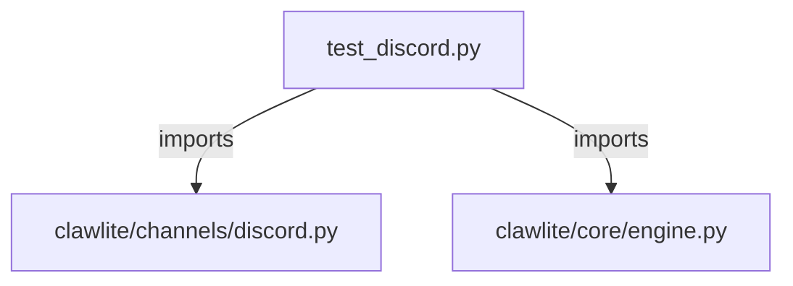

# CONNECTIONS tests/channels/test_discord.py

## Relationship Summary

- Imports 2 internal file(s).
- Imported by 0 internal file(s).
- Matched test files: 0.

## Internal Imports

- `clawlite/channels/discord.py`
- `clawlite/core/engine.py`

## Candidate Sources Exercised By This Test File

- `clawlite/channels/discord.py`
- `clawlite/gateway/discord_thread_binding.py`
- `clawlite/tools/discord_admin.py`

## Mermaid

