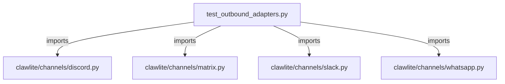

# CONNECTIONS tests/channels/test_outbound_adapters.py

## Relationship Summary

- Imports 4 internal file(s).
- Imported by 0 internal file(s).
- Matched test files: 0.

## Internal Imports

- `clawlite/channels/discord.py`
- `clawlite/channels/matrix.py`
- `clawlite/channels/slack.py`
- `clawlite/channels/whatsapp.py`

## Mermaid

