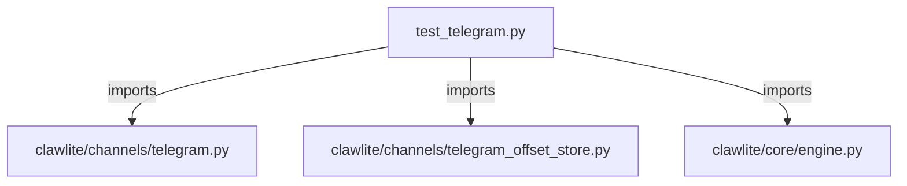

# CONNECTIONS tests/channels/test_telegram.py

## Relationship Summary

- Imports 3 internal file(s).
- Imported by 0 internal file(s).
- Matched test files: 0.

## Internal Imports

- `clawlite/channels/telegram.py`
- `clawlite/channels/telegram_offset_store.py`
- `clawlite/core/engine.py`

## Candidate Sources Exercised By This Test File

- `clawlite/channels/telegram.py`
- `clawlite/channels/telegram_aux_updates.py`
- `clawlite/channels/telegram_dedupe.py`
- `clawlite/channels/telegram_delivery.py`
- `clawlite/channels/telegram_inbound_dispatch.py`
- `clawlite/channels/telegram_inbound_message.py`
- `clawlite/channels/telegram_inbound_runtime.py`
- `clawlite/channels/telegram_interactions.py`
- `clawlite/channels/telegram_offset_runtime.py`
- `clawlite/channels/telegram_offset_store.py`
- `clawlite/channels/telegram_outbound.py`
- `clawlite/channels/telegram_pairing.py`
- `clawlite/channels/telegram_status.py`
- `clawlite/channels/telegram_transport.py`

## Mermaid

