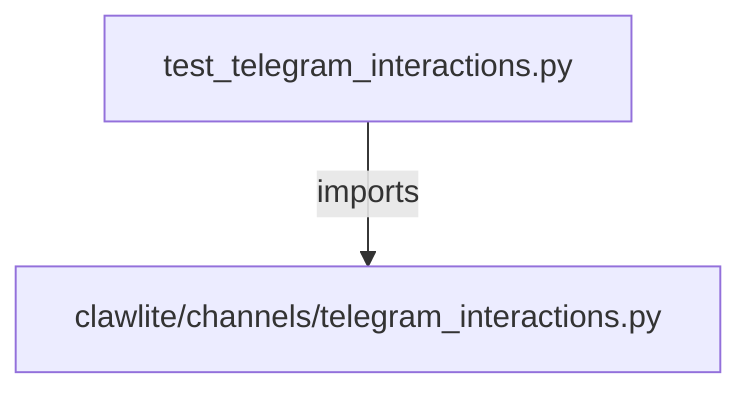

# CONNECTIONS tests/channels/test_telegram_interactions.py

## Relationship Summary

- Imports 1 internal file(s).
- Imported by 0 internal file(s).
- Matched test files: 0.

## Internal Imports

- `clawlite/channels/telegram_interactions.py`

## Candidate Sources Exercised By This Test File

- `clawlite/channels/telegram.py`
- `clawlite/channels/telegram_interactions.py`

## Mermaid

