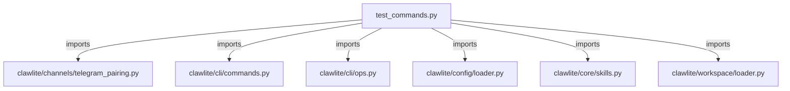

# CONNECTIONS tests/cli/test_commands.py

## Relationship Summary

- Imports 6 internal file(s).
- Imported by 0 internal file(s).
- Matched test files: 0.

## Internal Imports

- `clawlite/channels/telegram_pairing.py`
- `clawlite/cli/commands.py`
- `clawlite/cli/ops.py`
- `clawlite/config/loader.py`
- `clawlite/core/skills.py`
- `clawlite/workspace/loader.py`

## Candidate Sources Exercised By This Test File

- `clawlite/cli/commands.py`

## Mermaid

