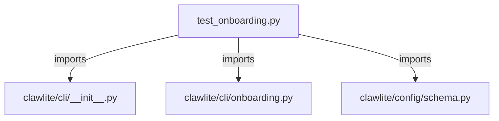

# CONNECTIONS tests/cli/test_onboarding.py

## Relationship Summary

- Imports 3 internal file(s).
- Imported by 0 internal file(s).
- Matched test files: 0.

## Internal Imports

- `clawlite/cli/__init__.py`
- `clawlite/cli/onboarding.py`
- `clawlite/config/schema.py`

## Candidate Sources Exercised By This Test File

- `clawlite/cli/onboarding.py`

## Mermaid

