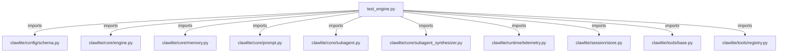

# CONNECTIONS tests/core/test_engine.py

## Relationship Summary

- Imports 11 internal file(s).
- Imported by 0 internal file(s).
- Matched test files: 0.

## Internal Imports

- `clawlite/config/schema.py`
- `clawlite/core/engine.py`
- `clawlite/core/memory.py`
- `clawlite/core/prompt.py`
- `clawlite/core/subagent.py`
- `clawlite/core/subagent_synthesizer.py`
- `clawlite/runtime/telemetry.py`
- `clawlite/session/store.py`
- `clawlite/tools/base.py`
- `clawlite/tools/registry.py`
- `clawlite/utils/logging.py`

## Candidate Sources Exercised By This Test File

- `clawlite/core/engine.py`
- `clawlite/gateway/engine_diagnostics.py`

## Mermaid

