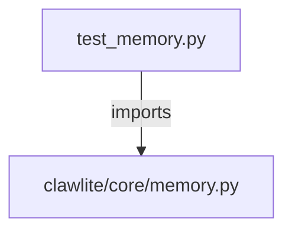

# CONNECTIONS tests/core/test_memory.py

## Relationship Summary

- Imports 1 internal file(s).
- Imported by 0 internal file(s).
- Matched test files: 0.

## Internal Imports

- `clawlite/core/memory.py`

## Candidate Sources Exercised By This Test File

- `clawlite/core/memory.py`
- `clawlite/core/memory_add.py`
- `clawlite/core/memory_api.py`
- `clawlite/core/memory_artifacts.py`
- `clawlite/core/memory_backend.py`
- `clawlite/core/memory_classification.py`
- `clawlite/core/memory_consolidator.py`
- `clawlite/core/memory_curation.py`
- `clawlite/core/memory_history.py`
- `clawlite/core/memory_ingest.py`
- `clawlite/core/memory_layers.py`
- `clawlite/core/memory_maintenance.py`
- `clawlite/core/memory_monitor.py`
- `clawlite/core/memory_policy.py`
- `clawlite/core/memory_privacy.py`
- `clawlite/core/memory_proactive.py`
- `clawlite/core/memory_profile.py`
- `clawlite/core/memory_prune.py`
- `clawlite/core/memory_quality.py`
- `clawlite/core/memory_reporting.py`

## Mermaid

