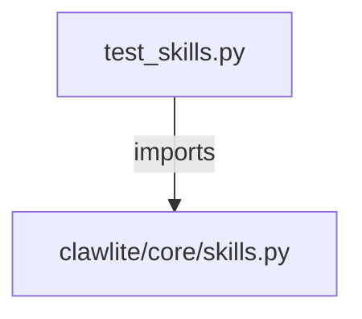

# CONNECTIONS tests/core/test_skills.py

## Relationship Summary

- Imports 1 internal file(s).
- Imported by 0 internal file(s).
- Matched test files: 0.

## Internal Imports

- `clawlite/core/skills.py`

## Candidate Sources Exercised By This Test File

- `clawlite/core/skills.py`
- `clawlite/skills/__init__.py`
- `clawlite/skills/model-usage/scripts/model_usage.py`
- `clawlite/skills/skill_creator.py`
- `clawlite/skills/tmux/scripts/find-sessions.sh`
- `clawlite/skills/tmux/scripts/wait-for-text.sh`
- `clawlite/tools/skill.py`

## Mermaid

