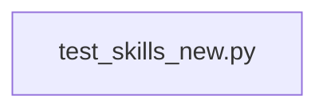

# CONNECTIONS tests/core/test_skills_new.py

## Relationship Summary

- Imports 0 internal file(s).
- Imported by 0 internal file(s).
- Matched test files: 0.

## Candidate Sources Exercised By This Test File

- `clawlite/core/skills.py`
- `clawlite/tools/skill.py`

## Mermaid

