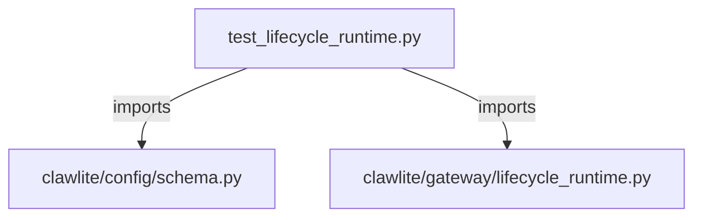

# CONNECTIONS tests/gateway/test_lifecycle_runtime.py

## Relationship Summary

- Imports 2 internal file(s).
- Imported by 0 internal file(s).
- Matched test files: 0.

## Internal Imports

- `clawlite/config/schema.py`
- `clawlite/gateway/lifecycle_runtime.py`

## Candidate Sources Exercised By This Test File

- `clawlite/gateway/lifecycle_runtime.py`

## Mermaid

