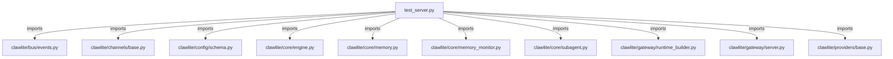

# CONNECTIONS tests/gateway/test_server.py

## Relationship Summary

- Imports 13 internal file(s).
- Imported by 0 internal file(s).
- Matched test files: 0.

## Internal Imports

- `clawlite/bus/events.py`
- `clawlite/channels/base.py`
- `clawlite/config/schema.py`
- `clawlite/core/engine.py`
- `clawlite/core/memory.py`
- `clawlite/core/memory_monitor.py`
- `clawlite/core/subagent.py`
- `clawlite/gateway/runtime_builder.py`
- `clawlite/gateway/server.py`
- `clawlite/providers/base.py`
- `clawlite/scheduler/heartbeat.py`
- `clawlite/utils/__init__.py`
- `clawlite/workspace/loader.py`

## Candidate Sources Exercised By This Test File

- `clawlite/gateway/server.py`

## Mermaid

