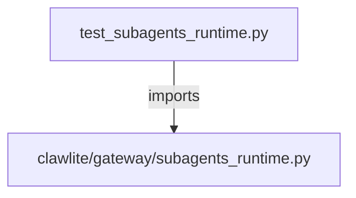

# CONNECTIONS tests/gateway/test_subagents_runtime.py

## Relationship Summary

- Imports 1 internal file(s).
- Imported by 0 internal file(s).
- Matched test files: 0.

## Internal Imports

- `clawlite/gateway/subagents_runtime.py`

## Candidate Sources Exercised By This Test File

- `clawlite/core/subagent.py`
- `clawlite/gateway/subagents_runtime.py`
- `clawlite/tools/agents.py`

## Mermaid

