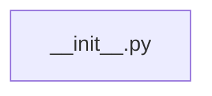

# CONNECTIONS tests/jobs/__init__.py

## Relationship Summary

- Imports 0 internal file(s).
- Imported by 0 internal file(s).
- Matched test files: 0.

## Candidate Sources Exercised By This Test File

- `clawlite/__init__.py`
- `clawlite/bus/__init__.py`
- `clawlite/channels/__init__.py`
- `clawlite/cli/__init__.py`
- `clawlite/config/__init__.py`
- `clawlite/core/__init__.py`
- `clawlite/dashboard/__init__.py`
- `clawlite/gateway/__init__.py`
- `clawlite/jobs/__init__.py`
- `clawlite/providers/__init__.py`
- `clawlite/runtime/__init__.py`
- `clawlite/scheduler/__init__.py`
- `clawlite/session/__init__.py`
- `clawlite/skills/__init__.py`
- `clawlite/tools/__init__.py`
- `clawlite/utils/__init__.py`
- `clawlite/workspace/__init__.py`
- `scripts/__init__.py`

## Mermaid

