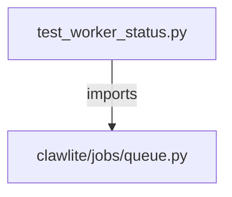

# CONNECTIONS tests/jobs/test_worker_status.py

## Relationship Summary

- Imports 1 internal file(s).
- Imported by 0 internal file(s).
- Matched test files: 0.

## Internal Imports

- `clawlite/jobs/queue.py`

## Mermaid

