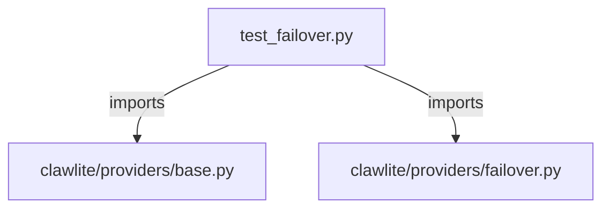

# CONNECTIONS tests/providers/test_failover.py

## Relationship Summary

- Imports 2 internal file(s).
- Imported by 0 internal file(s).
- Matched test files: 0.

## Internal Imports

- `clawlite/providers/base.py`
- `clawlite/providers/failover.py`

## Candidate Sources Exercised By This Test File

- `clawlite/providers/failover.py`

## Mermaid

