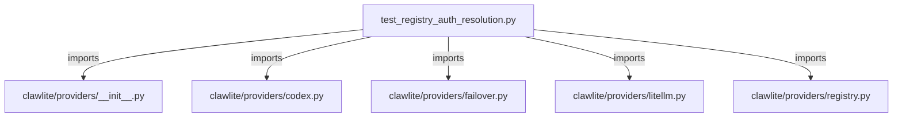

# CONNECTIONS tests/providers/test_registry_auth_resolution.py

## Relationship Summary

- Imports 5 internal file(s).
- Imported by 0 internal file(s).
- Matched test files: 0.

## Internal Imports

- `clawlite/providers/__init__.py`
- `clawlite/providers/codex.py`
- `clawlite/providers/failover.py`
- `clawlite/providers/litellm.py`
- `clawlite/providers/registry.py`

## Candidate Sources Exercised By This Test File

- `clawlite/providers/registry.py`
- `clawlite/tools/registry.py`

## Mermaid

