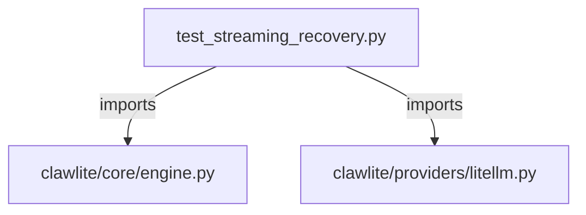

# CONNECTIONS tests/providers/test_streaming_recovery.py

## Relationship Summary

- Imports 2 internal file(s).
- Imported by 0 internal file(s).
- Matched test files: 0.

## Internal Imports

- `clawlite/core/engine.py`
- `clawlite/providers/litellm.py`

## Mermaid

